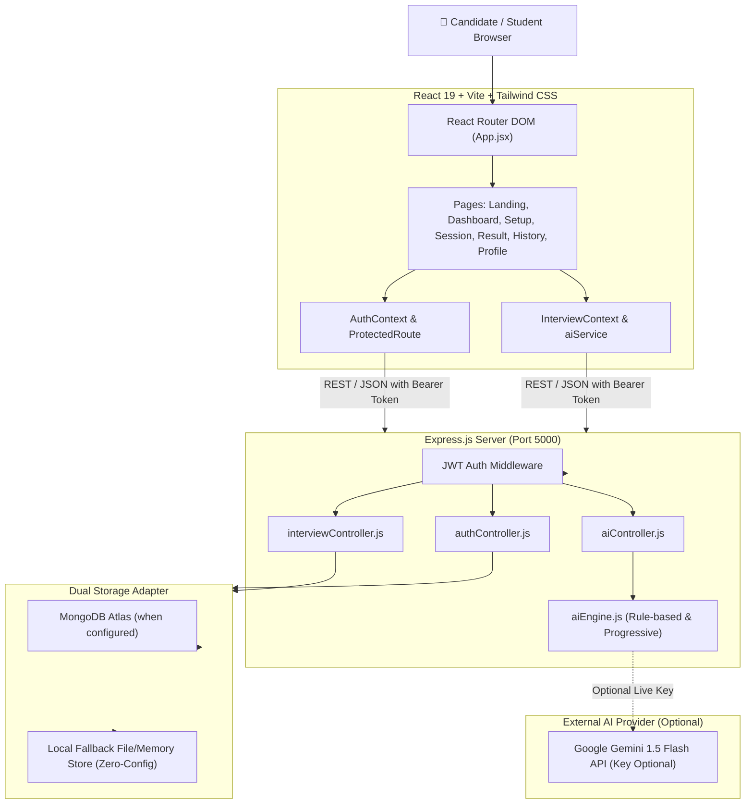

# Interview AI Assistant
> *“Practice. Perform. Improve.”*
>
> **An Intelligent Mock Interview Platform for Students & Job Seekers**  
> Built strictly adhering to the Software Requirements Specification (SRS) & High-Level Design Document.

---

## 📑 1. SRS Analysis & Project Overview

### Purpose & Vision
The **Interview AI Assistant** is a web-based AI-powered SaaS platform engineered to prepare students, freshers, and career switchers for competitive technical and behavioral interviews. Unlike generic chatbots, the system delivers structured, role-specific mock interviews, rigorously scores every answer across four key criteria (0–10 scale), produces actionable feedback, and tracks candidate improvement over time.

---

## 🎯 2. The 5 Core Features (Mapped to SRS Section 3)

| Feature | SRS FR Mapping | Description |
| :--- | :--- | :--- |
| **Feature 1: User Authentication & Profile Preferences** | **FR1, FR3** | Secure JWT authentication with bcrypt password hashing, form validation, password visibility toggle, protected routes (`/dashboard`, `/interview/*`, `/history`, `/profile`), and customizable interview defaults (Target Role, Experience Level). |
| **Feature 2: Interview Configuration & Adaptive Question Generation** | **FR5, FR6** | Multi-role selection (Python, Java, Full Stack, Data Analyst, SWE, or Custom), 3 experience tiers (Beginner, Intermediate, Advanced), 3 tracks (Technical, Behavioral, Mixed), question count (5, 10, 15), optional technical topic, summary confirmation, and progressive difficulty generation. |
| **Feature 3: Interactive Mock Interview Session** | **FR7** | Distraction-free session view with question counters, progress bar, real-time timer, answer textarea with word/character counts, Skip Question, and guarded submission state preventing duplicate calls. |
| **Feature 4: 4-Criteria Answer Evaluation & Instant Feedback Engine** | **FR8, FR9, FR13** | Rigorous 0–10 scoring on **Correctness**, **Relevance**, **Completeness**, and **Clarity** without artificial score inflation. Circular score indicator, specific strengths, missing edge cases, constructive tips, and an exemplary sample model answer before moving forward. |
| **Feature 5: Comprehensive Performance Report, AI Recommendations & History Tracker** | **FR10, FR11, FR12** | Aggregated score breakdown, Recharts bar and radar mastery charts, concrete AI recommendations linking weak areas to practical exercises (e.g. *SQL Joins → practice INNER, LEFT and RIGHT JOIN queries*), score delta improvement tracking (+Δ%), and full question-by-question review with single-read document retrieval. |

---

## 📊 3. SRS Traceability Matrix

| SRS Req ID | Requirement Name | Implemented Component / Service | API Endpoint | Page Route |
| :--- | :--- | :--- | :--- | :--- |
| **FR1** | User Authentication | `authController.js`, `authMiddleware.js`, `AuthContext.jsx` | `POST /api/auth/register`<br>`POST /api/auth/login`<br>`GET /api/auth/me` | `/login`<br>`/register` |
| **FR2** | Landing Page | `Landing.jsx` with Hero, 4 Feature Cards, 3-Step Flow, and honest educational disclaimer | *Client-rendered* | `/` |
| **FR3** | User Profile Management | `Profile.jsx`, `authController.updateProfile` (email locked for security) | `PUT /api/auth/profile` | `/profile` |
| **FR4** | Dashboard | `Dashboard.jsx`, `interviewController.getDashboardSummary` | `GET /api/interviews/stats/summary` | `/dashboard` |
| **FR5** | Interview Setup & Confirmation | `InterviewSetup.jsx`, role, level, track, count, topic, and summary confirmation card | *Client Context State* | `/interview/setup` |
| **FR6** | AI Question Generation | `aiEngine.generateQuestions`, progressive difficulty (Beginner/Intermediate/Advanced) | `POST /api/ai/generate-questions` | `/interview/setup` |
| **FR7** | Mock Interview Session | `InterviewSession.jsx`, progress bar, timer, guarded submission state ("AI is evaluating...") | *Interactive Session* | `/interview/session` |
| **FR8** | 4-Criteria Answer Evaluation | `aiEngine.evaluateAnswer`, `ScoreIndicator.jsx`, `CriterionBar.jsx` (0–10 scale) | `POST /api/ai/evaluate-answer` | `/interview/session` |
| **FR9** | Personalized Constructive Feedback | Strengths, missing points, feedback, and improved sample answer panels | `POST /api/ai/evaluate-answer` | `/interview/session` |
| **FR10** | Final Performance Report | `InterviewResult.jsx`, score aggregations, duration, question review | `POST /api/interviews` | `/interview/result` |
| **FR11** | AI Recommendations | `aiEngine.generateReportRecommendations`, linking weak areas to specific study actions | `POST /api/ai/generate-report` | `/interview/result` |
| **FR12** | Interview History & Improvement | `History.jsx`, previous vs latest score comparison, improvement percentage (+Δ%), report modal | `GET /api/interviews`<br>`GET /api/interviews/:id` | `/history` |
| **FR13** | Error Handling & Validation | Client/server validators, single automatic retry on AI failure, graceful error messages | *Middleware & Controllers* | *All routes* |
| **FR14** | Fallback Mode | Deterministic fallback question bank across 5 core roles & tracks (zero-cost offline ready) | `FALLBACK_QUESTION_BANK` | `/interview/*` |

---

## 🏗️ 4. System Architecture



---

## 🗄️ 5. Data Models (SRS Section 7)

### `User`
```json
{
  "_id": "ObjectId / string",
  "name": "Alex Morgan",
  "email": "alex@example.com",
  "password": "hashed_bcrypt_password",
  "preferredRole": "Full Stack Developer",
  "experienceLevel": "Intermediate",
  "createdAt": "2026-09-30T09:16:35.661Z"
}
```

### `Interview` (Embedded Document Schema)
```json
{
  "_id": "int_1790759809189_5kcvj",
  "userId": "user_id_reference",
  "jobRole": "Python Developer",
  "experienceLevel": "Beginner",
  "interviewType": "Technical",
  "technicalTopic": "Python OOP",
  "questionCount": 5,
  "answeredCount": 4,
  "skippedCount": 1,
  "overallScore": 8.2,
  "criterionScores": {
    "correctness": 8.5,
    "relevance": 8.5,
    "completeness": 8.0,
    "clarity": 8.0
  },
  "duration": 360,
  "report": {
    "strengths": ["Clear explanation of mutable vs immutable types."],
    "areasToImprove": ["Mention reference counting and garbage collection."],
    "recommendations": [
      {
        "topic": "Python Memory & Data Structures",
        "action": "Build practical exercises testing mutable vs immutable behavior and memory profiling with tracemalloc.",
        "resources": "Fluent Python & Official Python Data Model Docs"
      }
    ]
  },
  "questions": [
    {
      "questionId": "q_1",
      "question": "Explain the difference between mutable and immutable types in Python.",
      "category": "Core Python",
      "difficulty": "Beginner",
      "userAnswer": "Mutable types like lists can be modified in place...",
      "skipped": false,
      "score": 8.5,
      "correctness": 8.5,
      "relevance": 9.0,
      "completeness": 8.0,
      "clarity": 8.5,
      "feedback": "Strong explanation covering identity and memory.",
      "strengths": ["Clear terminology", "Practical code examples"],
      "missingPoints": ["Mentioned id() but did not elaborate on default mutable arguments in functions"],
      "improvedAnswer": "In Python, mutable types..."
    }
  ],
  "createdAt": "2026-09-30T09:16:49.189Z"
}
```

---

## 🛠️ 6. Technology Stack (Strictly Free Tier)

| Layer | Technologies |
| :--- | :--- |
| **Frontend** | React 19, Vite, Tailwind CSS, Lucide React, Recharts, Axios, React Router Dom |
| **Backend** | Node.js, Express.js, JWT (`jsonwebtoken`), `bcryptjs`, CORS, Dotenv |
| **Database** | MongoDB Atlas Free Tier + Built-in Local Resilient Fallback Store (Zero-config out of the box) |
| **AI Layer** | High-Fidelity rule-based AI Engine with progressive questions, 4-criteria scoring, and concrete study recommendations + optional Gemini 1.5 Flash adapter |
| **Deployment** | Vercel (Frontend), Render / Vercel Serverless (Backend) |

---

## 🚀 7. How to Run Locally

### Prerequisites
- Node.js (v18+ recommended, tested on v24)
- npm (v9+)

### Step 1: Install All Dependencies
Run from the root directory:
```bash
npm run install:all
```
*(Or install in `server` and `client` individually)*:
```bash
cd server && npm install
cd ../client && npm install --legacy-peer-deps
```

### Step 2: Start Both Server and Client
From the root directory:
```bash
npm run dev
```
- **Backend API**: `http://localhost:5000` (Health check at `http://localhost:5000/api/health`)
- **Frontend App**: `http://localhost:5173`

> **Note on Zero Configuration**: You do **not** need a running MongoDB daemon or an API key to run this project! If MongoDB is not detected, the resilient local storage adapter activates automatically, ensuring zero errors and complete functionality.

---

## 🧪 8. Test Demo Credentials
For instant demonstration:
- **Email:** `demo.student@example.com` (or click *"Click to autofill Demo Student credentials"* on the login page)
- **Password:** `password123`

---

## 🌐 9. Deployment Instructions

### Deploy Frontend to Vercel
1. Set the root directory to `client`.
2. Framework Preset: `Vite`.
3. Build Command: `npm run build`.
4. Output Directory: `dist`.
5. Environment Variable: `VITE_API_URL=https://your-backend-render-app.onrender.com/api`.

### Deploy Backend to Render
1. Set the root directory to `server`.
2. Build Command: `npm install`.
3. Start Command: `node server.js`.
4. Environment Variables:
   - `PORT=5000`
   - `JWT_SECRET=your_jwt_secret`
   - `MONGO_URI=your_free_mongodb_atlas_uri` (optional; falls back to local storage if omitted)
   - `CLIENT_URL=https://your-frontend-app.vercel.app`

---

## 🏆 Summary
Interview AI Assistant bridges academic computer science concepts with modern corporate technical interviews. By adhering to the exact specifications in the Software Requirements Specification (SRS), it ensures students and job seekers have a reliable, honest, and effective platform to **Practice. Perform. Improve.**
